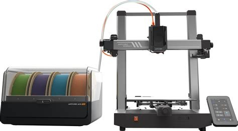
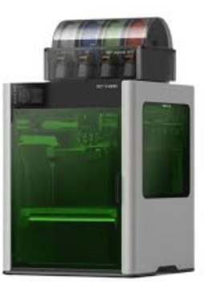
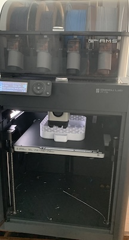
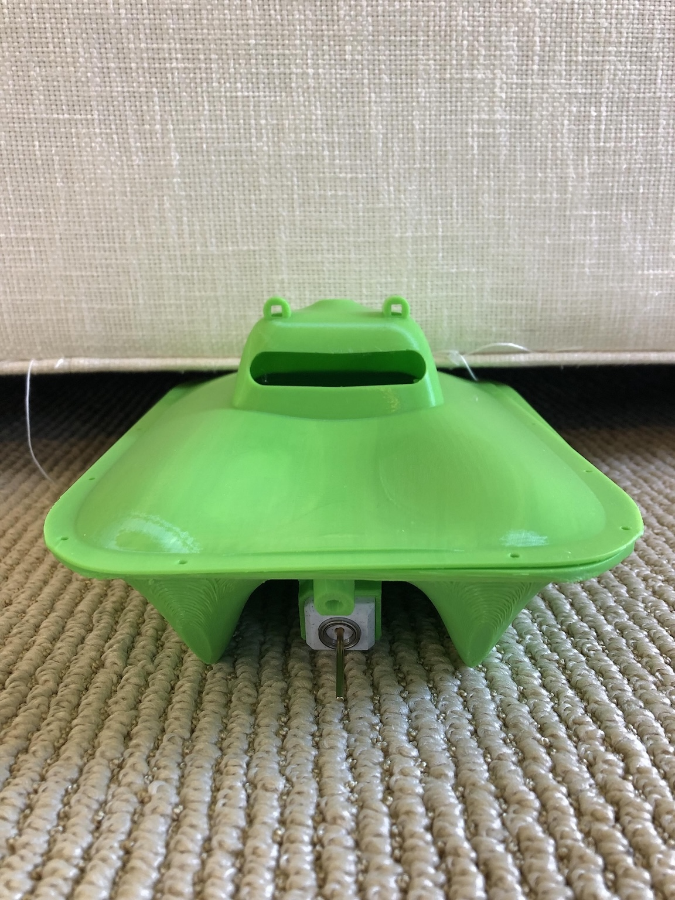
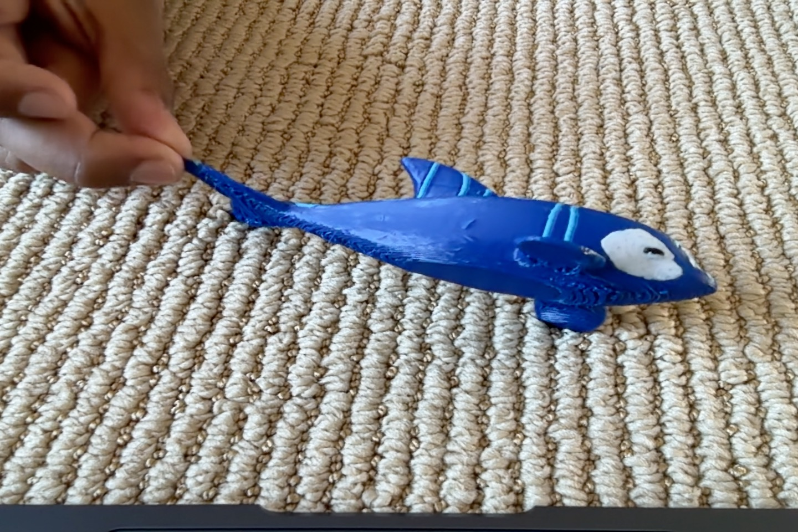

## Welcome. This is how to make 3d models properly.
 Ok, first you need your printer. We have choices for budget, for most things, and a good all rounder.

 
## Budget : Anycubic Kobra 3 V2 Combo 
The Anycubic Kobra 3 V2 Combo is a budget printer at $260. It provides the most bang for your buck because the most well known manufacturer, Bambu Labs, releases printers like this one with a bit more features, for $900! It has an AMS, basically a box that changes different filaments, the plastic you put in the machine to make different colored models. It also supports a wide range of filaments, like squishy TPU, hard PLA, or UV resistant PETG. Probably, since it is open air, you shouldn't print what are called <ins>engineering materials</ins>, which, as the name suggests, are used for engineering. These are generally tougher than other filaments and have other properties, like acid resistance. It also has a brass nozzle, which contains ≤0.06 grams of lead, and you know how that will end.  (spoiler, <ins>NOT FOOD SAFE!</ins>) 

## For most things : Bambu Labs H2D Laser Full Combo
The Bambu Labs H2D Laser Full Combo has an AMS as it states in the name, but it also has a laser. The laser can cut wood, thin metals, and also engrave food! Something you can't do with the AMS is combine squishy TPU and any other filament in one print. With the H2D, you can. There are 2 nozzles on the H2D so that you can print TPU and any other filament! It is also enclosed so you can print engineering materials. It comes with a hardened steel nozzle that is resistant to wear and tear, but isn't food safe.  The price is $3,000.

## A good all rounder: Bambu Labs P1S Combo. 
The Bambu Labs P1S has one nozzle and it has an monochrome display, but it is in between the previous printers and is a workhorse that you could use to say, start an online store and sell printed models. It comes with an AMS, an enclosure, and a stainless steel nozzle which is considered food safe. There are many upgrades you can make for it, as it is similar to the X1C, whic has the most documentation by far of any current Bambu Labs printer. A very good printer, at $699 in my opinion.

## Conclusion on 3d printers

If you are just starting with the hobby, you should buy an Anycubic Kobra 3 V2 Combo. If you want a step-up 3D printer, then the Bambu Labs P1S Combo is a no-brainer. If you are looking for a pro grade printer, you should purchase the Bambu labs H2D Laser Full Combo.

## Filaments
 After you select your printer, you need filament. Filament is the plastic that you melt to create 3D models. Filament comes in many colors, sizes and types. Filament can have different properties like heat resistance or squishiness.       <i> *Note that this is only some polymers, and there are more that 10,000 out there!<i> 
## Common polymers:
PLA,PETG,TPU
 These polymers are mostly nontoxic and are suitable for beginners, especially PLA because of its low melting point and how cheap you can buy it.

__________________________________________________________________________________________________________________________________________________
## Suitable for outdoor use:
PETG, ABS, ASA
ABS and ASA release toxic styrene fumes, which means you should print them with an exhaust pipe and in a well ventilated area with the windows open.
____________________________________________________________________________________________________________________________________________ 
## Composites:
Any composite filament

A composite is a polymer blended with something else, usually not a polymer, to add properties, like wood filament looks like wood.( and sometimes smells like it.)
____________________________________________________________________________________________________________________________________________ 

## Supports:
HIPS,PVA
Sometimes, a really complex model will use supports to be able to print it. The removal of these supports are usually difficult. Filaments like HIPS, which dissolve in special chemicals, that other filaments don't dissolve in.
____________________________________________________________________________________________________________________________________________ 

## Ams vs Non-Ams

The Ams is short for Automatic Material System. Sometimes it is also called an MFS or Multi-Filament System. What it means is that it switches filaments automatically instead of having to pause the print, cut the filament, load the filament, and purge the newly loaded filament. You can mix different colors automatically and mix different filaments. An example of mixing filaments would be to put TPU that is Ams safe and PLA together in one print. The benefit is that the Ams does the switching for you and that it is less manual work. 

                
single color boat                  An orca (multicolor with ams)

## Thank You For Reading This Page 
To check out my other things, go to [My github page. ](https://www.github.com/Ramacsv)
Thanks for reading!

